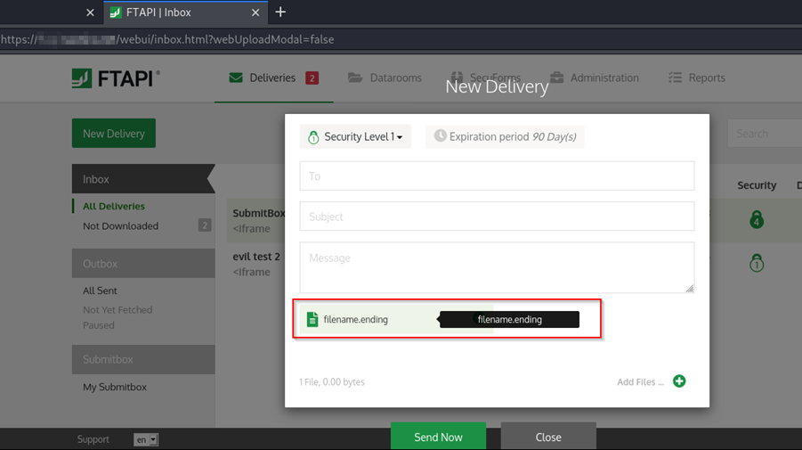

# FTAPI Stored XSS (via File Upload)

An unauthenticated, stored Cross-Site Scripting (XSS) vulnerability in the file upload component of the “FTAPI” file exchange web application allows an attacker to inject JavaScript. This may allow a malicious entity to compromise the session of a victim user upon file retrieval. Access to confidential files or administrative access is possible. 

The vulnerability was reported as CVE-2021-25277.

__Versions affected: FTAPI 4.X < 4.11__

## Background

We discovered that it is possible to inject JavaScript code by submitting a file with a crafted file name to the application. The file name is displayed in a text box with an alt-text hover feature. By hovering over the file name, the alt-text element is displayed. The element then shows the file name without sufficient filtering, which results in an XSS vulnerability.
 


Figure 1: Vulnerable alt-text element in the file text box

## Steps to Reproduce
By uploading a file with the following name, an alert box is triggered upon file retrieval:
 
 ")

Figure 2: Proof-of-Concept file name executing an alert()

For a successful upload, the file must not be empty. The following bash command may create a suitable file:
```
echo "test" >> "<iframe onload=alert('XSS')>"
```

The file name box with the vulnerable alt-text component is not only displayed during upload, but also once the file is retrieved. The XSS payload is executed, once the mouse hovers over the green file box:
 
  is executed in the context of the victim’s inbox")

Figure 3: Proof-of-Concept alert() is executed in the context of the victim’s inbox

## Root Cause
This issue exists due to insufficient input filtering in the alt-text element of the file name box. To mitigate the issue, we recommend applying input sanitization to the file name upon uploading and/or applying output sanitization to the alt-text component. HTML tags, as well as quotes and escape sequences should be encoded.

## Fix
All software versions of the 4.X branch < version 4.11 are affected. The vendor was informed of the finding on January 1, 2021. The vulnerability is fixed with version 4.11 which is available here:
https://docs.ftapi.com/display/RN/4.11.0

