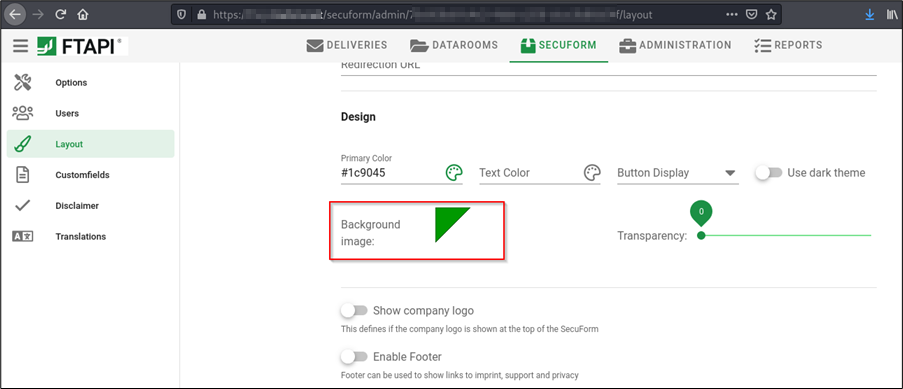
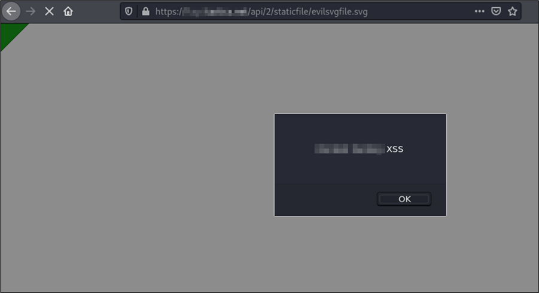

# FTAPI Stored XSS (via Submit Box Template)

A stored Cross-Site Scripting (XSS) vulnerability in the submit box layout editor of the “FTAPI” file exchange web application allows an attacker to upload SVG files with embedded JavaScript. This may allow a malicious entity to compromise the session of a victim by tricking them into visiting the uploaded file. 

The vulnerability was reported as CVE-2021-25278.

__Versions affected: FTAPI 4.X < 4.11__
 


Figure 1: Vulnerable background image upload in the submit box layout editor

## Background

A user with administrative rights may be able to upload a malicious SVG file with embedded JavaScript via the background image file upload of the submit box layout editor. This could lead to XSS once the file is visited by a victim user.

## Steps to Reproduce

By uploading the following SVG file as a background image, an alert is triggered:
```svg
<?xml version="1.0" standalone="no"?>
<!DOCTYPE svg PUBLIC "-//W3C//DTD SVG 1.1//EN" "http://www.w3.org/Graphics/SVG/1.1/DTD/svg11.dtd">

<svg version="1.1" baseProfile="full" xmlns="http://www.w3.org/2000/svg">
   <polygon id="triangle" points="0,0 0,50 50,0" fill="#009900" stroke="#004400"/>
   <script type="text/javascript">
      alert('XSS');
   </script>
</svg>
```
The uploaded file is saved in the public „/api/2/staticfile/“ directory and leads to XSS once it is viewed:
 


Figure 2: Stored XSS through an uploaded malicious SVG file

## Root Cause

This issue exists due to insufficient input filtering in the background image file upload. To mitigate the issue, we recommend disallowing the upload of SVG files. Alternatively, SVG sanitization or image conversion (e.g., to PNG) should be implemented.

## Fix

All software versions of the 4.X branch < version 4.11 are affected. The vendor was informed of the finding on January 1, 2021. The vulnerability is fixed with version 4.11 which is available here: 
https://docs.ftapi.com/display/RN/4.11.0

