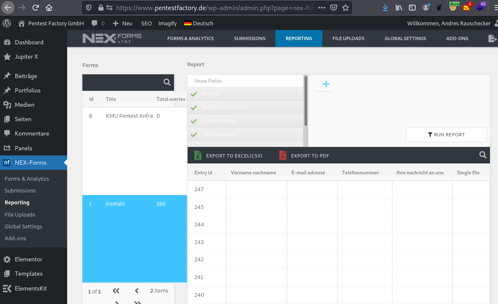
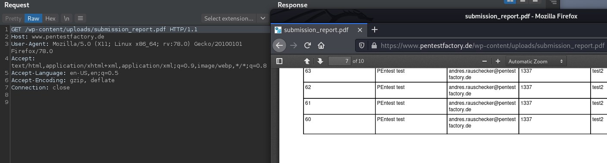

# NEX Forms Authentication Bypass for PDF Reports

The Wordpress NEX Forms plugin allows users to export form submissions into a PDF file. However, the plugin fails to implement proper access protections. This allows an unauthenticated attacker to access the PDF report and obtain sensitive or personally identifiable information that was submitted via the form. 

The vulnerability was reported as CVE-2021-34675.

__Versions affected: NEX Forms <= 7.8.7__

## Background

NEX Forms is a Wordpress plugin with more than 12.000 sales. It allows creating forms based on a variety of templates and offers several functions for managing form submissions. During a security evaluation of the plugin in a test environment, we were able to identify access control vulnerabilities in the report export section.

## Steps to Reproduce
The "Reporting" section of the NEX Forms admin backend allows users to aggregate and export form submissions into Excel and PDF formats. Once a user exports a selection of form submissions into PDF, the server generates a PDF file and stores it the Wordpress content directory: __/wp-content/uploads/submission_report.pdf__
 
 

Figure 1: Reporting section with Excel and PDF export functions

However, this file is not access protected and an attacker can request the file without prior authentication.
This allows an attacker to obtain the data that was submitted via the forms, as can be seen in the following screenshot:
 
 
 
Figure 2: Proof-of-Concept: Unauthenticated access to the PDF report

## Root Cause
This issue exists due to insufficient access controls for the generated export file. To mitigate the issue, we recommend returning the PDF file only upon request as a server response of the export function. To prevent unauthorized access, the file should not be stored in a public directory of the web server.

## Fix
The vendor was informed of the finding on June 2, 2021. The product changelog reports the vulnerability to be fixed with version 7.8.8. More information can be found here: https://codecanyon.net/item/nexforms-the-ultimate-wordpress-form-builder/7103891
