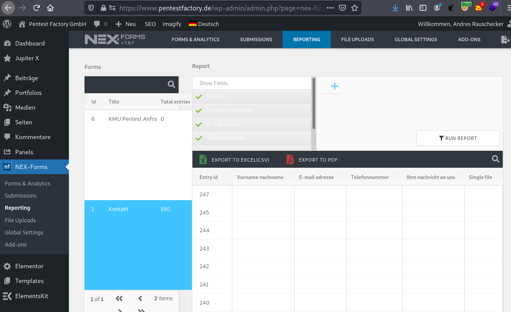
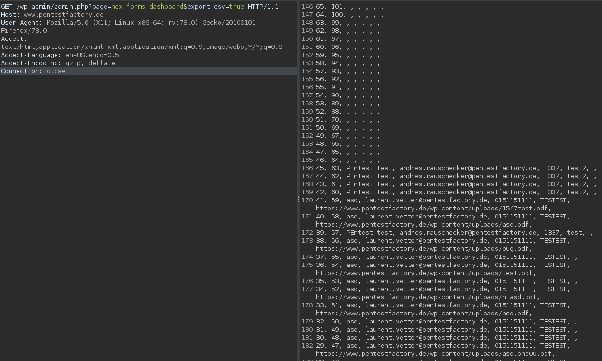

# NEX Forms Authentication Bypass for Excel Reports

The Wordpress NEX Forms plugin allows users to export form submissions into an Excel file. However, the plugin fails to implement proper access protections. This allows an unauthenticated attacker to access the Excel report and obtain sensitive or personally identifiable information that was submitted via the form.

The vulnerability was reported as CVE-2021-34676.

__Versions affected: NEX Forms <= 7.8.7__

## Background

NEX Forms is a Wordpress plugin with more than 12.000 sales. It allows creating forms based on a variety of templates and offers several functions for managing form submissions. During a security evaluation of the plugin in a test environment, we were able to identify access control vulnerabilities in the report export section.

## Steps to Reproduce
The "Reporting" section of the NEX Forms admin backend allows users to aggregate and export form submissions into Excel and PDF formats. To request an Excel export, the user needs to request the export via the backend "Export To Excel" button. Once the excel sheet was generated it can be accessed by supplying the global GET parameter "export_csv" set to "true" for any backend endpoint.
 
 

Figure 1: Reporting section with Excel and PDF export functions

Validating the access controls for the "export_csv" handler, we noticed that the plugin does not check for valid authentication and it is possible to request the data unauthenticated:
 
 
 
Figure 2: Proof-of-Concept: Unauthenticated access to the Excel report

## Root Cause
This issue exists due to missing access control checks in the "export_csv" plugin handler. To mitigate the issue, we recommend implementing access checks that verify the presence of a valid authentication cookie, before data is returned via the URL handler.

## Fix
The vendor was informed of the finding on June 2, 2021. The product changelog reports the vulnerability to be fixed with version 7.8.8. More information can be found here: https://codecanyon.net/item/nexforms-the-ultimate-wordpress-form-builder/7103891
