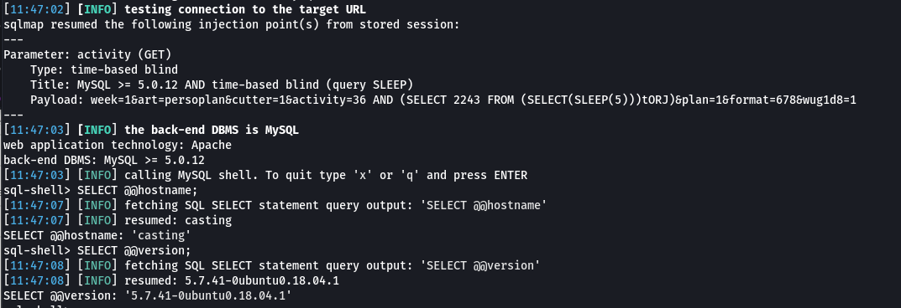

# eMedia Consulting simpleRedak - Blind SQL Injecction

An SQL Injection vulnerability was discovered in the /module/scheduler/index.php component. 

The vulnerability was reported as CVE-2023-33762.

__Versions affected: simpleRedak <= 2.47.23.05__
 

Figure 1: Request showing the vulnerable "activity" GET parameter

## Background

An authenticated attacker with access to the scheduler (PR:L) may inject SQL commands into the "activity" GET parameter. This results in a blind SQL injection vector.

## Steps to Reproduce

The following payload was detected via exemplary exploitation through SQLmap:

Figure 2: Exemplary exploitation with SQLmap

## Root Cause

This issue exists due to not using parametrised queries. Only the usage of prepared statements or stored procedures with non-dynamic and 
previously bound parameters (“parametrised query”) can prevent SQL injection attacks.

## Fix

All software versions up to and including version 2.47.23.05 are affected. The vendor was informed of the finding on May 5, 2023. The vulnerability is fixed with version 2.47.23.06.
