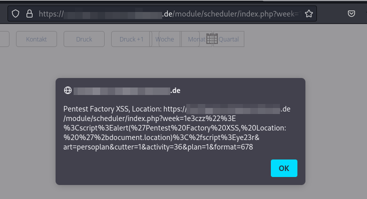
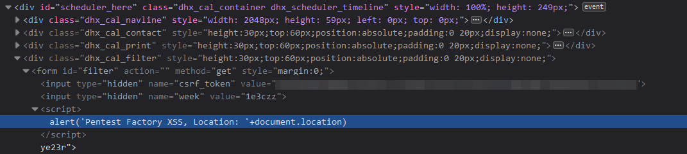

# eMedia Consulting simpleRedak - Reflected Cross-Site Scripting

A reflected Cross-Site Scripting (XSS) vulnerability was discovered in the /scheduler/index.php component. 

The vulnerability was reported as CVE-2023-33763.

__Versions affected: simpleRedak <= 2.47.23.05__
 


Figure 1: Reflected XSS via injecting a malicious string into a URL parameter

## Background

An attacker may craft a malicious link that contains an XSS payload. Should the victim click on the link, this could lead to XSS in their browser window.

## Steps to Reproduce

For the proof-of-concept screenshots we have used the following payload:
```
<url>/module/scheduler/index.php?week=1e3czz%22%3E%3Cscript%3Ealert(%27Pentest%20Factory%20XSS,%20Location:%20%27%2bdocument.location)%3C%2fscript%3Eye23r&art=persoplan&cutter=1&activity=36&plan=1&format=678
```

## Root Cause

This issue exists due to insufficient input filtering in a form that reflects the "week" parameter as an attribute value. By supplying a double quote character (") it is possible to break out of the attribute string and inject custom HTML.



Figure 2: Root cause: Insufficient input filtering in the reflected URL parameter

## Fix

All software versions up to and including version 2.47.23.05 are affected. The vendor was informed of the finding on May 5, 2023. The vulnerability is fixed with version 2.47.23.06.
