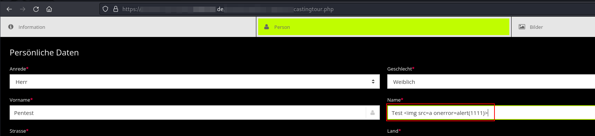
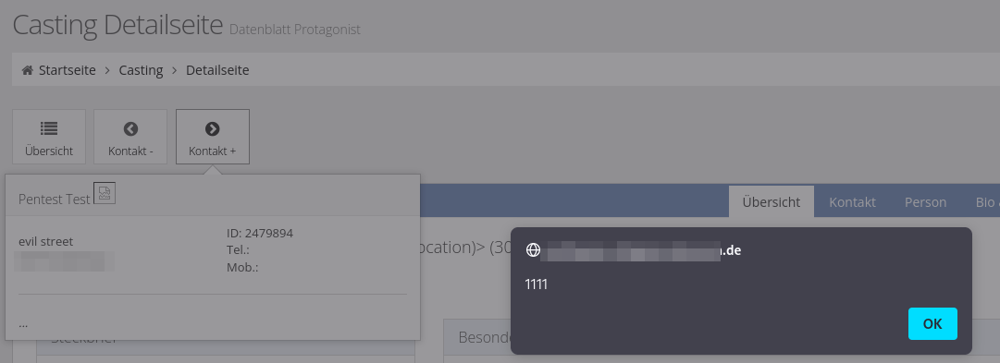
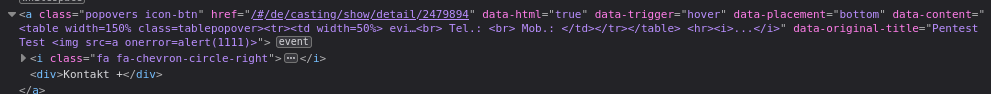

# eMedia Consulting simpleRedak - Stored Cross-Site Scripting

A stored Cross-Site Scripting (XSS) vulnerability was discovered in the casting backend (/#/de/casting/show/detail/<ID>). 

The vulnerability was reported as CVE-2023-33764.

__Versions affected: simpleRedak <= 2.47.23.05__
 
## Background

An attacker may submit a malicious casting application that contains an XSS payload in the first or last name fields. Once a backend user opens the detail view of the submitted casting applications, hovering over a Bootstrap popover component results in XSS.

## Steps to Reproduce
                                               


Figure 1: Submitting an exemplary application with a malicious last name

For the proof-of-concept screenshots we have used the following payload:
```
Test 
```
Once the user in the backend hovers over the "Kontakt" button, a Bootstrap popover is created. Should the next profile be the profile with our malicious name, the XSS payload is executed:
  


Figure 2: Hovering over the Kontakt button results in XSS via a Bootstrap popover event
  
## Root Cause

This issue exists due to insufficient input filtering in the "data-original-title" Bootstrap popover attribute. No adequate sanitization is performed and the malicious name is rendered as an innerHTML assignment when the hover-Event fires:



Figure 3: Root cause: Hover event creates a Bootstrap popover that includes malicious HTML

## Fix

All software versions up to and including version 2.47.23.05 are affected. The vendor was informed of the finding on May 5, 2023. The vulnerability is fixed with version 2.47.23.06.

